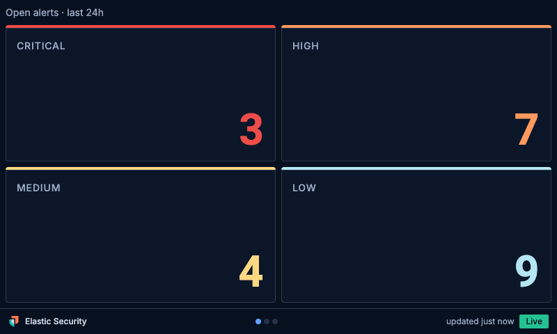
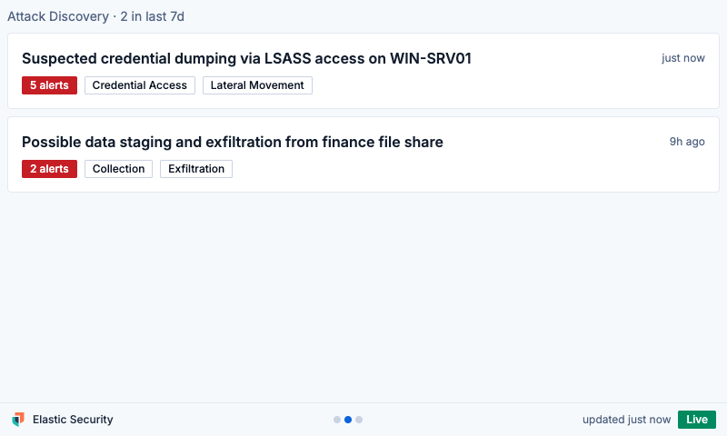
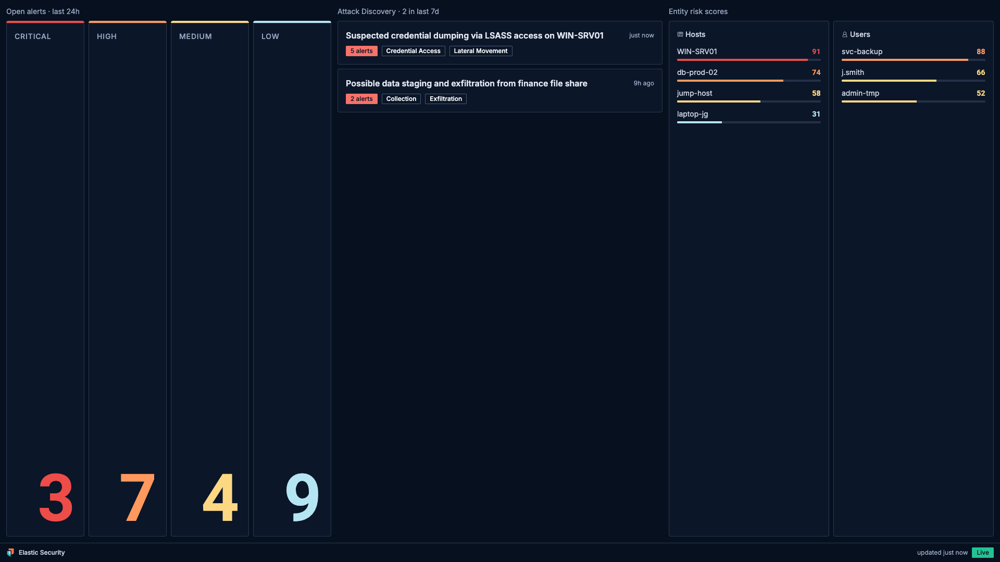

# elastic-pi-display

A Raspberry Pi desk display for Elastic Security. It shows the current state
of your SIEM at a glance:

- **Open alerts by severity**: critical, high, medium, and low counts, big
  enough to read from across the room
- **Attack Discovery**: the latest AI-generated attack discoveries
- **Entity risk scores**: the riskiest hosts and users, where the risk engine
  is enabled

The frontend is built with Elastic's own [EUI](https://eui.elastic.co)
component library, so it looks and feels like an extension of Elastic
Security. Light and dark mode are both supported.



| Light mode, Attack Discovery view | Large screen, everything at once |
| --- | --- |
|  |  |

## How it works

```text
+---------------------------- Raspberry Pi ----------------------------+
|                                                                      |
|  Chromium (kiosk, systemd unit)                                      |
|      | server-sent events                                            |
|  FastAPI backend (systemd service, 127.0.0.1:8080)                   |
|      | polls with API key auth                                       |
+------+---------------------------------------------------------------+
       v
  Elasticsearch  <- alert counts, risk scores
  Kibana         <- Attack Discovery
```

A small Python service polls your Elastic deployment, caches the state, and
pushes updates to a prebuilt EUI web app over server-sent events. Chromium
shows the app full screen. If Elastic becomes unreachable, the display keeps
the last known data and marks it as stale.

Data sources that your deployment does not offer (for example Attack
Discovery on an older stack, or risk scores without the right licence tier)
are detected at startup and their tiles are hidden. Alerts are the only
required source.

## Requirements

- Any Raspberry Pi with a screen. Tested on a Pi 3B with a 3.5 inch SPI
  touchscreen and on larger HDMI displays. The layout adapts to the
  resolution: small screens show one view at a time with tap to cycle,
  larger screens show more side by side.
- Raspberry Pi OS (Lite or Desktop), with SSH access.
- An Elastic deployment with Elastic Security. Elastic Cloud hosted,
  self-managed, and serverless projects are all supported.
- Network access from the Pi to your Elastic endpoints on port 443, plus
  NTP so the clock stays correct for TLS.

## Setup

Three steps, all over SSH. The full walkthrough, including screen types and
troubleshooting, is in [docs/setup.md](docs/setup.md).

### 1. Create an API key

The display needs a read-only API key. See
[docs/api-key-privileges.md](docs/api-key-privileges.md) for a Dev Tools
request that grants the minimum privileges, or create a key in Kibana as a
read-only security analyst user.

### 2. Run the installer on the Pi

```bash
curl -fsSL https://raw.githubusercontent.com/jamesagarside/elastic-pi-display/main/deploy/install.sh -o install.sh
sudo bash install.sh                       # standard install
sudo bash install.sh --spi-panel           # GPIO SPI TFT screens (see docs/setup.md)
sudo bash install.sh --from-file <tarball> # air-gapped install from a copied release
```

The installer creates a service user, installs the backend and the prebuilt
frontend (no Node.js needed on the Pi), sets up the kiosk, and disables
screen blanking.

### 3. Configure and reboot

```bash
sudo elastic-display setup   # asks for URLs, API key, and space, then tests them
sudo reboot
```

The wizard tests every data source against your deployment and shows what is
available before writing any config.

## Day-to-day administration

```bash
elastic-display test                          # re-test all data sources
sudo elastic-display setup                    # change settings or rotate the API key
journalctl -u elastic-pi-display -f           # backend logs
curl -s localhost:8080/api/health             # health check
```

To update, re-run the installer. It replaces the application but never
touches your config.

On the display itself: tap to cycle views, and tap a severity tile to see
that severity's most recent alerts (tap again to go back; it also returns
on its own after 30 seconds). The sun/moon icon in the top-right corner
switches between light and dark mode, and the choice persists across
reboots.

## Development

```bash
# backend
python3 -m venv .venv && .venv/bin/pip install -e "backend[dev]"
cd backend && ../.venv/bin/python -m pytest

# run the backend against your deployment (config in ~/.config/elastic-pi-display/)
.venv/bin/elastic-display setup
.venv/bin/elastic-display run

# frontend, with /api proxied to the backend
cd frontend && npm install && npm run dev
```

Releases are built by GitHub Actions on version tags (`v*`): the frontend
bundle, the backend wheel, and the deploy scripts are packaged into one
tarball, so the Pi never needs Node.js.

## Repository layout

| Path | What |
| --- | --- |
| `backend/` | FastAPI service, Elastic data sources, setup wizard CLI |
| `frontend/` | Vite + React + EUI kiosk app |
| `deploy/` | `install.sh`, systemd units, kiosk launchers |
| `docs/` | Setup guide, API key privilege guide, UniFi detection rules guide |

## Credits

Inspired by Simon's CLAUDE Inc desk display. This one shows the state of
your SIEM instead.

## License

MIT
